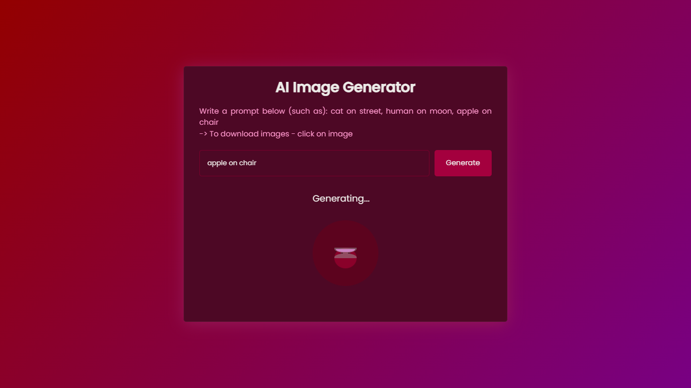

# Package/Script Name
AI Image Generator
## Aim

Generate images by given prompts.


## Purpose

To make image generation easy for exact need.


## Short description of package/script

- It is a made with huggingface.
- User can give it a prompt and get a image by clicking on image.


## Workflow of the Project

In given input field we first have to give a prompt.
After that on clicking of generate button our event listener takes the given description.

```js
// event listener for generate button
document.getElementById("generate").addEventListener('click', ()=>{
    const input = document.getElementById("user-prompt").value;
    generateImages(input);
})
```

And passes it to given async function generateImages:
```js
// generate images
async function generateImages(input){

}
```

In generateImages(), the function call two functions 
```js
// Disables Generate button and clears all images until generating the currenct images

disableGenerateButton();
clearImageGrid();
```

And with looping of the imagescount we generate the images by fetching the api.


## Setup instructions

1. Download the VS code extension - Live Server
2. Open index.html
3. Right click > Open with Live Server OR (ALT + L ALT + O)


## Detailed explanation of script, if needed

Code is commented at necessities.


## Compilation Steps

1.Define API Key:

The project starts by defining a constant apiKey containing the API key required for making requests to the Hugging Face model.
Set Image Count and Variables:

2.Set Image Count and Variables:

The script sets the number of images to generate (imageCount) and initializes a variable (selectImageNumber) to track the selected image number.

3.Random Number Generator:

The getRandomNum function generates a random number between a specified range.

4.Button State Functions:

Two functions (disableGenerateButton and enableGenerateButton) are defined to disable and enable the "Generate" button.

5.Clear Image Grid Function:

The clearImageGrid function clears the content of the HTML element with the ID "image-grid."

6.Image Generation Function:

The generateImages function takes user input, disables the "Generate" button, clears the image grid, and displays a loading indicator.
It then iterates to generate the specified number of images by making asynchronous requests to the Hugging Face model API.
Each image is displayed in the HTML using the image URL obtained from the API response.
The loading indicator is hidden, and the "Generate" button is re-enabled after image generation.

7.Image Download Function:

The downloadImage function is called when an image is clicked. It creates a link with the image URL and triggers a download of the image with a specified filename.

8.Event Listener:

An event listener is attached to the "Generate" button. When the button is clicked, it reads the user input, and the generateImages function is called with the input.
Note: The code assumes the existence of HTML elements with specific IDs ("generate," "user-prompt," "loading," and "image-grid"). Ensure that these elements are present in the corresponding HTML file where this script is used. Additionally, there is a potential typo in the code (disable should be disabled), so you may want to correct that.

## Output



## Conclusion

The AI Image Generator Project is ready to use and increase the productivity.

## Author(s)

[Aditya](https://github.com/aaadityaG)


## Disclaimers, if any

The huggingfaces api's my credits may end any time and you might not be able to use it so create your account and update the apikey in js file.